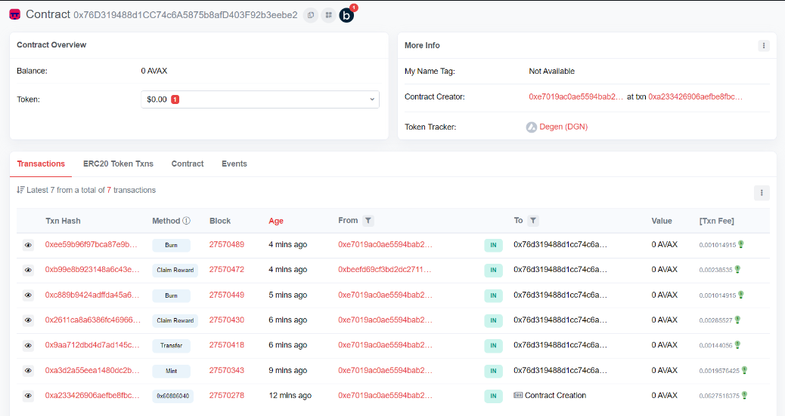

This contract empowers the creation of ERC-20 fungible tokens, unlocking a realm where digital assets can seamlessly be transferred, minted, and utilized for rewarding gaming experiences.

## Description

Deployed on the FUJI testnet, this contract is designed to generate fungible tokens tailored for redeemable rewards within the gaming ecosystem. Leveraging the ERC-20 standard, it seamlessly operates on the Fuji network, providing a robust set of functionalities:

- Minting of Tokens
- Transfer of Tokens
- Redeeming of Tokens
- Burning of Tokens
- Checking of Balances

## Getting Started

### Executing program

Executing program To run this program, you can use Remix, an online Solidity IDE. To get started, go to the Remix website at https://remix.ethereum.org/.

Once you are on the Remix website, create a new file by clicking on the "+" icon in the left-hand sidebar. Save the file with a .sol extension (e.g., HelloWorld.sol). Copy and paste the following code into the file:

```javascript
// SPDX-License-Identifier: UNLICENSED
// SPDX-License-Identifier: MIT
pragma solidity ^0.8.18;

import "@openzeppelin/contracts/token/ERC20/ERC20.sol";
import "@openzeppelin/contracts/access/Ownable.sol";

contract DegenToken is ERC20, Ownable {
    struct Reward {
        string name;
        uint256 cost;
    }
    Reward[] public rewards; // List of available rewards
    mapping(address => mapping(uint256 => bool)) public claimedRewards;
    constructor() ERC20("Degen", "DGN") {
        rewards.push(Reward("Official Degen NFT - ", 50));
        rewards.push(Reward("Merchandise - ", 100));
        rewards.push(Reward("Credits -", 100));
    }
    function getTotalRewards() public view returns (uint256) {
        return rewards.length;
    }

    function decimals() public pure override returns(uint8){
        return 0;
    }

    function claimReward(uint256 rewardIndex) public {
        require(rewardIndex < rewards.length, "Reward index out of bounds");
        require(!claimedRewards[msg.sender][rewardIndex], "Reward already claimed");
        require(balanceOf(msg.sender) >= rewards[rewardIndex].cost, "Insufficient tokens");
        _approve(msg.sender,address(this),rewards[rewardIndex].cost);
        transfer(address(this), rewards[rewardIndex].cost);
        claimedRewards[msg.sender][rewardIndex] = true;
    }

    function mint(address to, uint256 amount) public onlyOwner {
        _mint(to, amount);
    }
    function transfer(address to,uint amount) public override returns(bool){
        require(amount <= balanceOf(msg.sender), "ERC20: transfer amount exceeds balance");
        _transfer(msg.sender, to, amount);
        return false;
    }

    function shop() public view returns(Reward[] memory) {
        return rewards;

    }


    function burn(address from, uint256 amount) public onlyOwner {
        _burn(from, amount);
    }
}
```

To compile the code, click on the "Solidity Compiler" tab in the left-hand sidebar. Make sure the "Compiler" option is set to "0.8.9" (or another compatible version), and then click on the "Compile HelloWorld.sol" button.

Once the code is compiled, you can deploy the contract by clicking on the "Deploy & Run Transactions" tab in the left-hand sidebar. Select the "DegenToken" contract from the dropdown menu, and then click on the "Deploy" button.

Once the contract is deployed, you can interact with it by calling the sayHello function. Click on the "DegenToken" contract in the left-hand sidebar, and then click on multiple functions available. Finally, click on the "transact" button to execute the function and retrieve the appropriate messages.

## Proof of work as the Fuji Contract detail

### Contract Address is provided as Application id as well



## Authors

Avanish Yadav

## License

This project is licensed under the MIT License - see the LICENSE.md file for details
